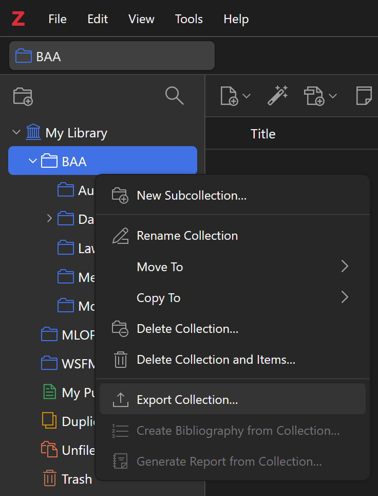
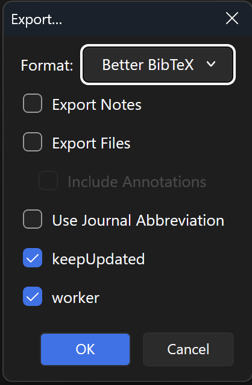
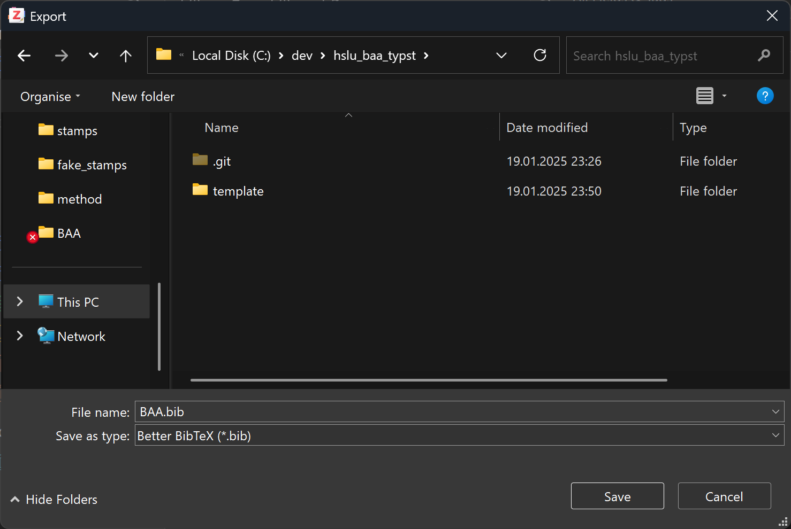
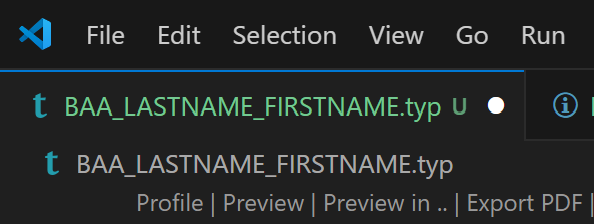

# BAA Typst Template

This repository contains a template for a BAA project documentation adhering to the HSLU guidelines (at least in the AI/ML domain). It is based on [typst](https://typst.app/) and the [Tinymist](https://github.com/Myriad-Dreamin/tinymist) vs code extension to efficiently write the report in a code editor. Typst is unfathomably faster compared to LATEX used locally or in e.g. Overleaf, as startup and rendering times are almost instant.

## Features

Multiple packages and tools are used to create a pleasant and fast writing experience, from managing the bibliography, to grammar/spelling checks, to acronyms and references.

1. typst and Tinymist are used to generate the report. It can be viewed inside vs code or the browser.
2. [Zotero](https://www.zotero.org/) and [Better BibTeX](https://github.com/retorquere/zotero-better-bibtex) manage the bibliography.
3. [LTEX+](https://github.com/ltex-plus/vscode-ltex-plus) checks the spelling and grammar.
4. [acrostiche](https://typst.app/universe/package/acrostiche/) handles acronyms.
5. [codly](https://typst.app/universe/package/codly/) is used to create good-looking code snippets.
6. [GIT LFS](https://git-lfs.github.com/) is used to track large files.

Furthermore, the following functions can be used for a better writing experience:

1. [**title-caption**](https://sitandr.github.io/typst-examples-book/book/snippets/chapters/outlines.html#long-and-short-captions-for-the-outline): Can be used to show a different caption in e.g. the list of figures than in the figure itself.
2. **todo** : Can be used to add big red text to the report to indicate that something is missing.

## Known Issues

1. The live preview has to be started from the [main file](BAA_LASTNAME_FIRSTNAME.typ). Tinymist will complain about missing references (e.g. citations) if the main file is not opened in the code editor. After live preview is started, the main file can be closed again.
2. The codly package can be buggy if a lot of code snippets are used, which results in the live preview not working. The generation of the pdf file still works. If this is happening, disable the codly package until the final pdf is generated.

## Installation

After cloning the repository, the following steps are necessary to set up the environment.

### Bibliography Export

Zotero can be configured to automatically export the bibliography on every change with the Better BibTeX plugin. After [installing](https://retorque.re/zotero-better-bibtex/installation/index.html) the plugin, do the following:

|                                                        |                                                                                           |                                                   |
| :----------------------------------------------------: | :---------------------------------------------------------------------------------------: | :-----------------------------------------------: |
|  |                                    |  |
|                 1. Export the library.                 | 2. Under Format, select `Better BibTeX`. Check the box `keepUpdated` as well as `worker`. |         3. Export the file to the folder.         |

If you want to change the export location afterwards, you can find the setting under `Preferences -> Better BibTeX -> Export`.

### GIT LFS

If you want to save the final report (or other large files) in the repository, you need to [install](https://docs.github.com/en/repositories/working-with-files/managing-large-files/installing-git-large-file-storage) GIT LFS. The repository is set up to track pdf files with GIT LFS. To track other files, add them to the [`.gitattributes`](./.gitattributes) file.

### VS Code Extensions

Tinymist is required for the live preview of the report, while LTEX+ is used for spelling and grammar checks. Both extensions will be suggested when opening the project for the first time in vs code, as they are defined in the [`.vscode/extensions.json`](./.vscode/extensions.json) file. If for some reason this does not work, you can install the extensions manually.

## Usage

After the installation, you can start the live preview by opening the [main file](BAA_LASTNAME_FIRSTNAME.typ) and then either clicking `Preview` to open live preview in vscode or `Preview in..` to open it in a browser.

### Template Configuration

In the [main file](BAA_LASTNAME_FIRSTNAME.typ), you can configure the following settings:

| Setting              | Description                                                                                                           |
| -------------------- | --------------------------------------------------------------------------------------------------------------------- |
| abstract_content     |                                                                                                                       |
| advisor              |                                                                                                                       |
| appendix_index       | Because the appendix is after the whole document, you need to tell the template where the main import file is located |
| authors              | Each author needs a name, address and email                                                                           |
| bibliography_link    | Pass the link to the bibliography file path here after you exported the file in Zotero                                |
| confidential         | This boolean parameter changes the checkbox on the declaration page                                                   |
| degree_program       |                                                                                                                       |
| degree_program_full  |                                                                                                                       |
| division             |                                                                                                                       |
| external_expert      |
|                      |
| expression_content   |                                                                                                                       |
| graduation_date      | The year of this date is visible on the declaration page                                                              |
| industry_partner     |
|                      |
| report_date          | The full date is shown on the title page                                                                              |
| signature_date       | This date is used next to your signature.                                                                             |
| signature_place      |                                                                                                                       |
| subtitle             |                                                                                                                       |
| title                |                                                                                                                       |
| and declaration page |
| university           | Displayed on the title and declaration page                                                                           |

### VS Code Settings

In [`.vscode/settings.json`](./.vscode/settings.json), the editor is set to break lines after 120 characters. This leads to a nice writing experience, even on wide screens. If you want to change this, you can do so in the settings. Additionally, vs code automatically formats the document on save.

## Notes

I am by no means an expert in typst, I was learning it while writing my own thesis. The experience was very positive though, and I wanted to share this template with others. If you have any questions or suggestions, feel free to open an issue or pull request.
